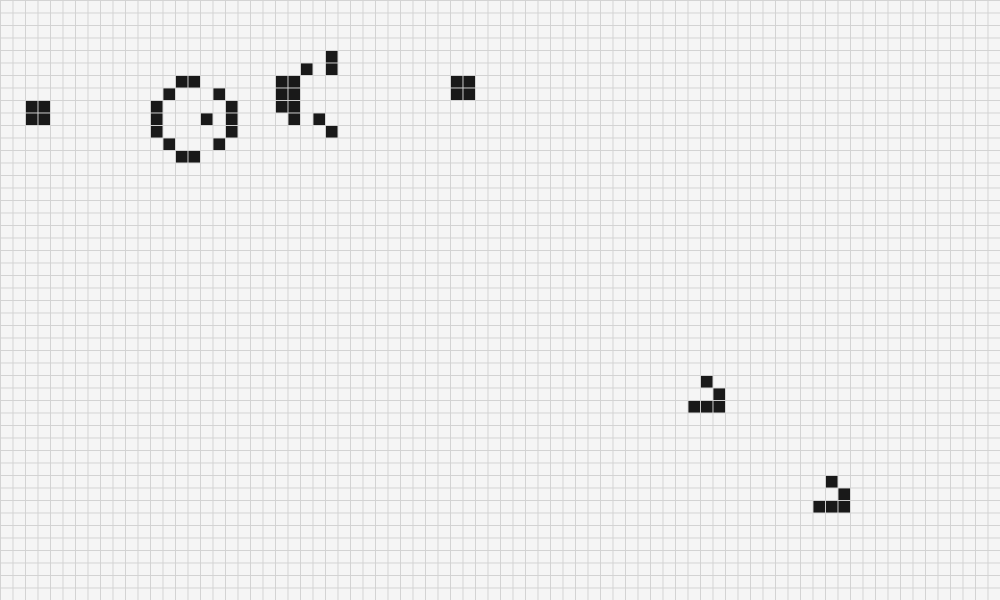

# Conway's Game of Life — MATLAB

An interactive implementation of Conway's Game of Life built entirely in MATLAB Live Scripts.

## How it works

The simulation runs on a 15×15 grid. The user clicks cells to seed the initial live population, then the program evolves the pattern one tick at a time until it reaches a still life (no further change).

**Conway's rules applied each tick:**
- A live cell with 2 or 3 neighbors survives
- A dead cell with exactly 3 neighbors comes alive
- All other cells die or remain dead

## File structure

| File | Role |
|---|---|
| `GameOfLife.mlx` | Main script — sets up grid, handles simulation loop |
| `drawCells.mlx` | Renders the grid using `meshgrid` and `rectangle` patches |
| `inputLiveCells.mlx` | Interactive mouse-click input to seed live cells |
| `evolveState.mlx` | Advances the board one full tick |
| `survive.mlx` | Rule check — does a live cell survive? |
| `awakens.mlx` | Rule check — does a dead cell come alive? |
| `liveCell.mlx` | Utility — checks whether a given cell is currently alive |

HTML previews of each script are in `Export/`.

## Running it

Open `GameOfLife.mlx` in MATLAB and run the script. A figure window will appear — click any cells to mark them as alive, then press **Enter** to start the simulation.

## Requirements

MATLAB (tested on R2024a). No toolboxes required.
